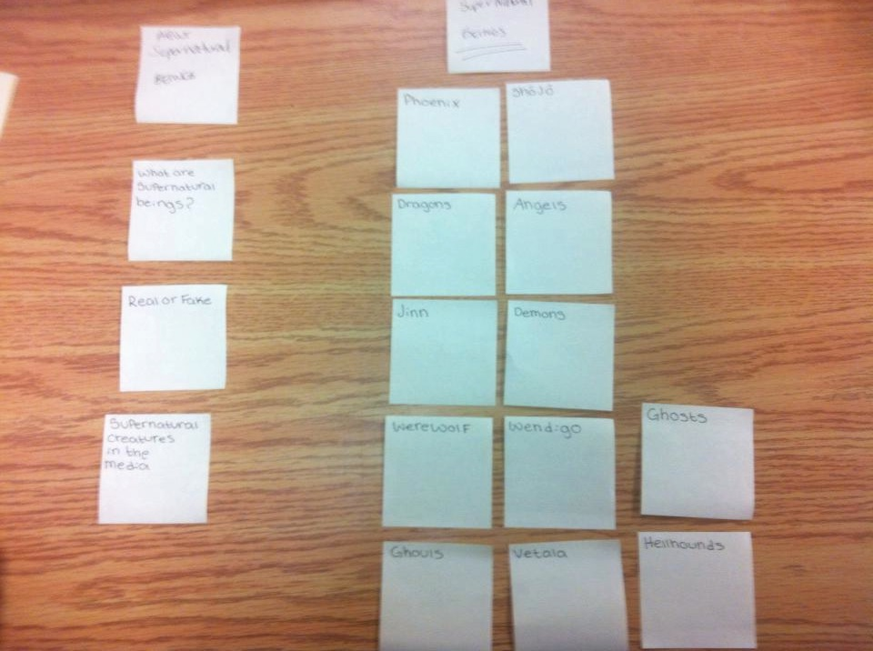
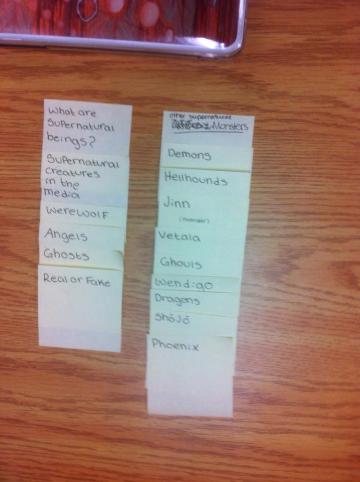

# Card sort report

The purpose of this card sort was to determine common navigation patterns and categories from the content of my large data-oriented website.

## Specifics

The card sort was conducted by Tirzah Wood on september 10th between the times of 3pm and 6pm with the following participants:

- Grace Walker
- Kathryn Hallett

### Cards

15 cards were used covering a broad range of applicable content for the website. The following topics were used as cards:

1. What are supernatural beings?
2. Real or fake?
3. Supernatural creatures in the media
4. Phoenix
5. dragons
6. Jinn
7. Werewolf
8. Ghouls
9. Shojo
10. Angels
11. Demons
12. Wendigo
13. Vetala
14. Ghosts
15. Hellhounds

# Card sort results

*Card sort 1 by Grace Walker*

*Card sort 2 by Kathryn Hallett*

## Observations

- Comments that were made by participants were all asking what some of things were that were written on the cards

- There were no questions that stood out.

- Kathryn had some issue with sorting the name of the creature she wondered if she should the creatures under categories or just put them all under the same category.

- The grouping from both participant was almost the same.

- I was not expecting the cards Angels, Demons, and were wolfs to be put under what are supernatural beings.

- The results were similar to my expectations.

- While watching the card sort I felt interested as to what the results would be.